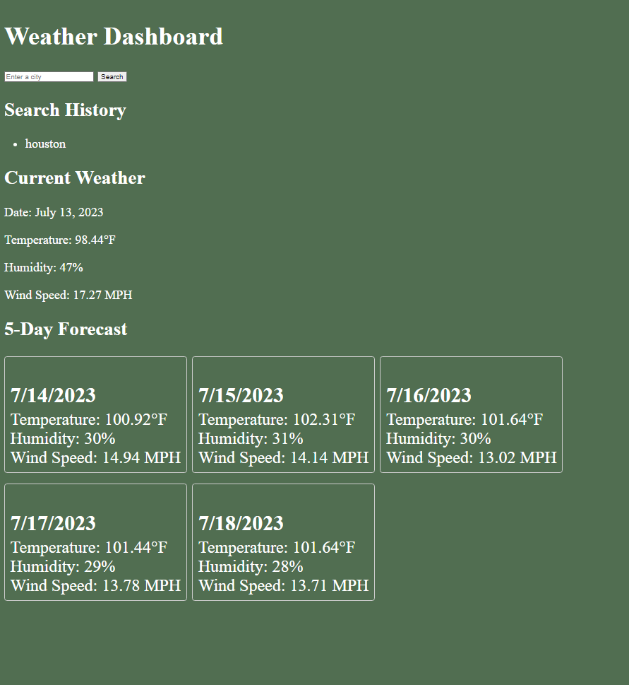

# Weather Dashboard
The Weather Dashboard is a web application that allows users to search for weather information for different cities. It displays the current weather details and a 5-day forecast for the selected city.

https://ccovin1.github.io/api-weather-site/
## 

## Features
Search for weather by city: Users can enter a city name in the search input field and click the "Search" button to retrieve weather information.
Current weather details: The application displays the current temperature, humidity, and wind speed for the selected city.
5-day forecast: The forecast section shows the temperature, humidity, and wind speed for the next 5 days.
Search history: The application keeps a record of the searched cities and displays them in a search history list.

## Technologies Used
HTML: Markup language for creating the structure of the web page.
CSS: Stylesheet language for styling the web page and forecast cards.
JavaScript: Programming language for handling form submission, fetching weather data, and updating the UI.
OpenWeatherMap API: Used to retrieve weather data for the searched cities.
## Setup and Usage
Clone the repository or download the code files.
Obtain an API key from OpenWeatherMap by signing up on their website.
Open the index.html file in a web browser.
Replace the apiKey variable in the script.js file with your actual OpenWeatherMap API key.
Enter a city name in the search input field and click the "Search" button to retrieve weather information.
The current weather details and forecast will be displayed on the page.
The searched city will be added to the search history list.

## Customization
Styling: You can modify the style.css file to customize the appearance of the Weather Dashboard according to your preferences.
Additional features: You can extend the functionality of the application by adding more features, such as displaying weather icons, implementing geolocation to get the user's current location, or adding more details to the forecast section.

##Credits
The Weather Dashboard utilizes the OpenWeatherMap API to retrieve weather data. Visit their website at https://openweathermap.org/ for more information.

## License
This project is licensed under the MIT License. Feel free to modify and distribute the code according to the terms of the license.